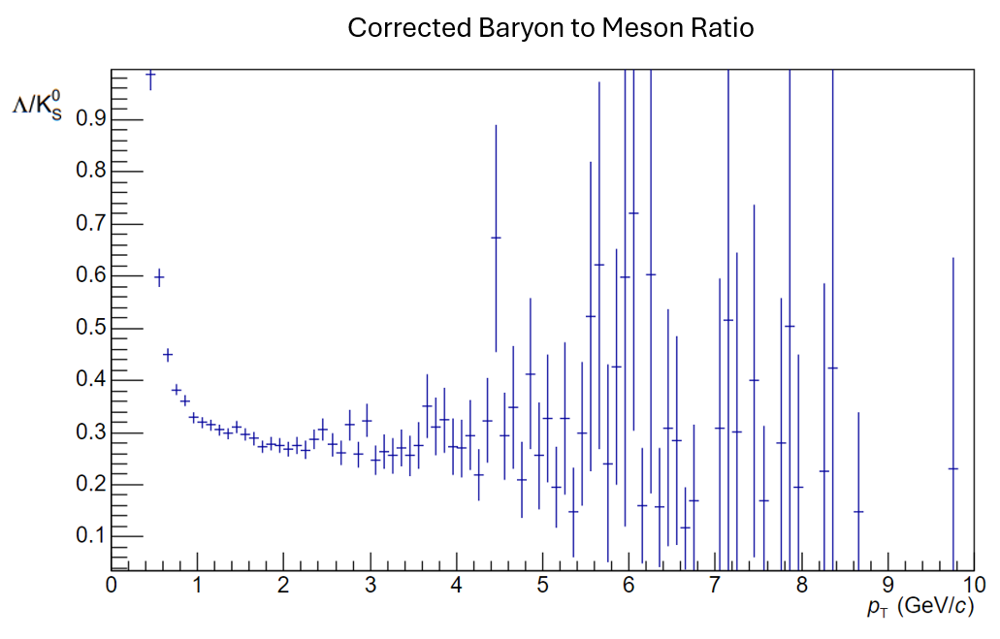
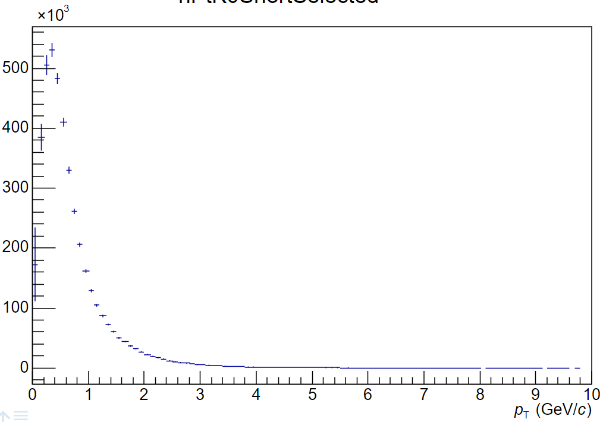
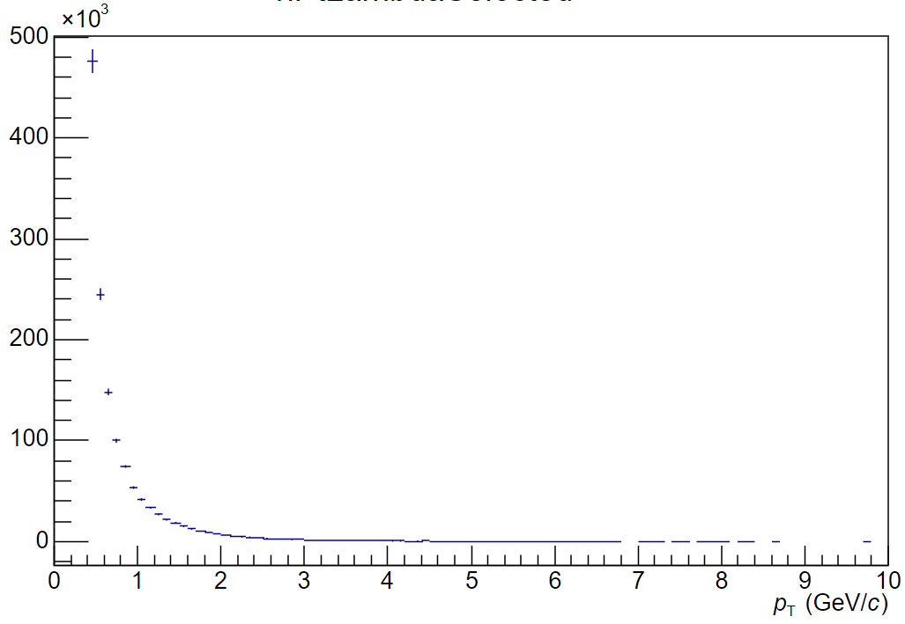
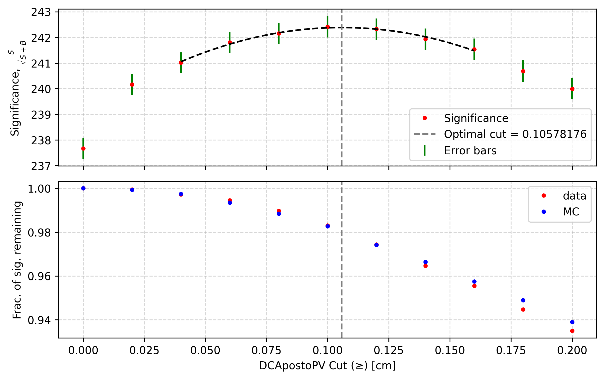
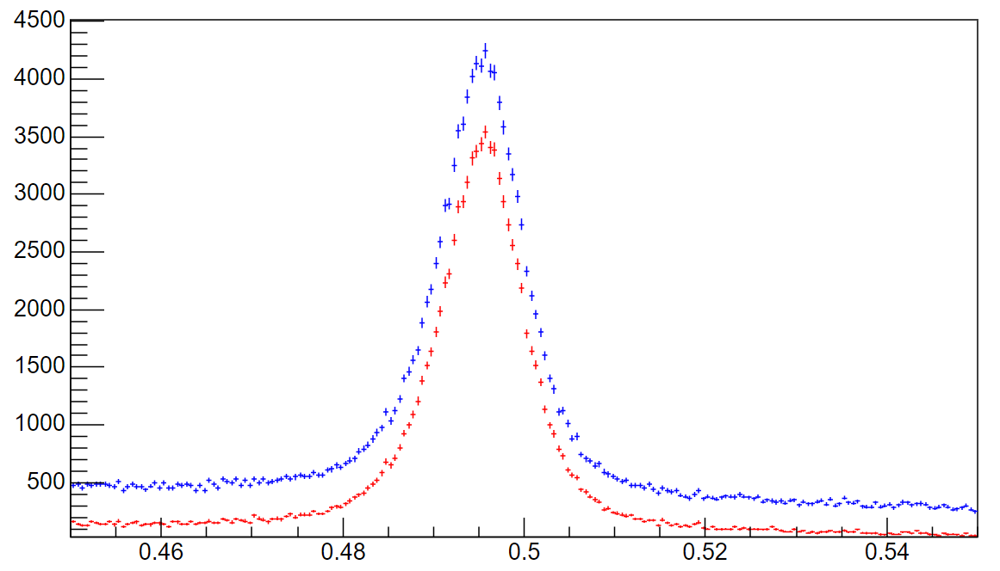
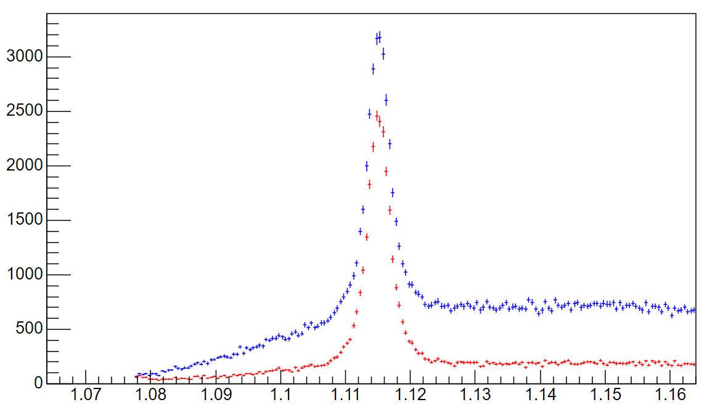
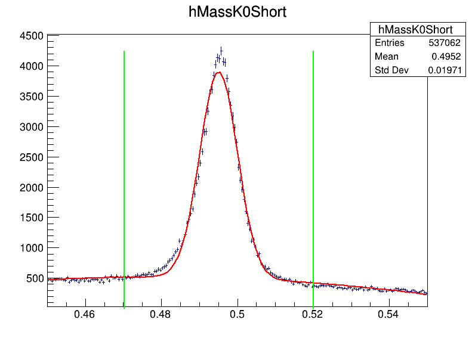
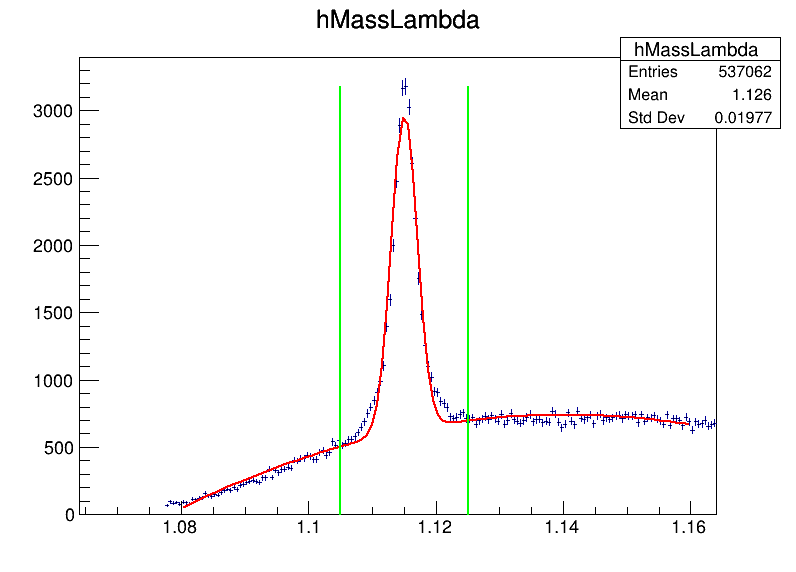
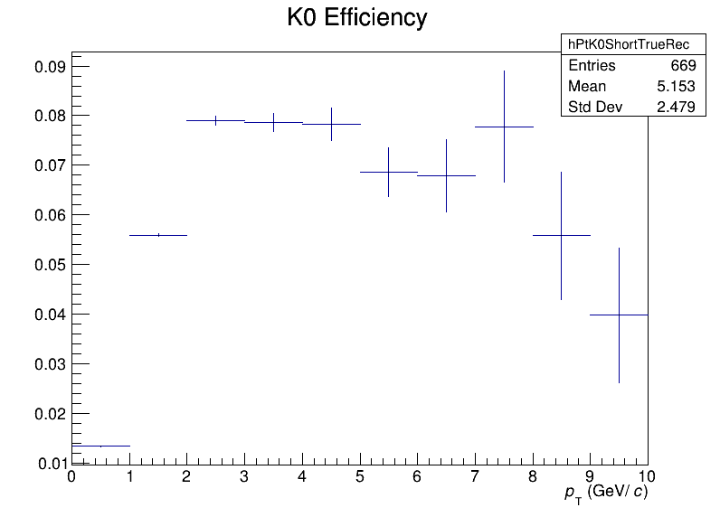
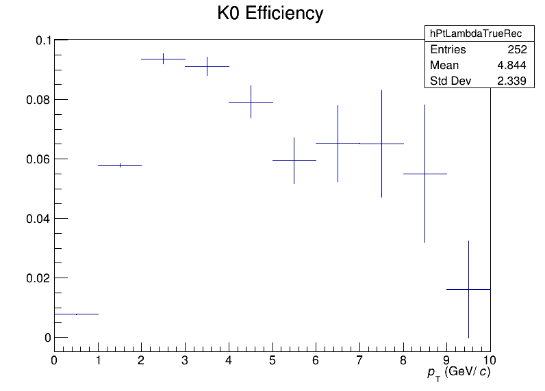

# ALICE Run-3 Strange Hadron Analysis
MSci Physics (University of Birmingham, 2024)

This repository contains the code and report from my final-year Master's project analysing K⁰s and Λ reconstruction efficiency in ALICE Run-3 data using ROOT and Python.

Originally developed between Sept 2023–May 2024 as part of my master’s thesis at CERN (ALICE experiment).  
Uploaded to GitHub in 2025 for public reference and portfolio purposes.

### Project Goals:
- Reconstruct neutral V⁰ particles from their charged decay products.
- Apply optimised selection cuts to maximise signal purity.
- Calculate detector reconstruction efficiencies using Monte Carlo simulations.
- Correct the measured spectra and compute the Λ/K⁰S baryon-to-meson ratio.

### Key achievements
- Developed ~90 % signal-retention V0 selection pipeline.
- Statistical significance improved via Monte-Carlo fits.
- Successfully obtained efficiency-corrected particle spectra and ratios.

📄 [Read the full MSci Project Report (PDF)](docs/Final_Report_BarnabyHowells.pdf) 
📊 [Download Presentation Slides (PDF)](docs/Seminar_Presentation_Slides.pdf)

## Key Results

### Λ/K⁰S Ratio

   <em>Run 3 data give a mid-pₜ ratio ≈ 0.3, lower than Run 2 (~0.6), hinting at reconstruction or calibration effects.</em> 

### Corrected Spectra

    <em>Both yields decrease exponentially with pₜ — Λ spectra (right) showing anomalous low-pₜ growth requiring further study.</em> 

## Data Analysis
### Workflow:
1. Event Reconstruction
Identify V⁰ candidates by implementing threshold cuts on five different parameters.

2. Cut Optimisation
Compute significance:
Scan each cut parameter to find the maximum significance.
Retain ≥ 90 % signal and ensure data/MC agreement ≤ 2 %.
Result: 86-89% total signal retention, background reduced by ~70 %.

3. Monte Carlo Efficiencies
Generate simulated pp collisions using ALICE MC framework.
Process events through detector geometry + reconstruction chain.
Compute efficiency = (reconstructed / generated) as function of pₜ.

4. Spectrum Correction & Ratio
Divide raw yields by efficiencies → corrected pₜ spectra.

### 📊 Data Files
Raw significance data used for cut optimization:

- [K⁰s Significance Data (Excel)](data/K0_Significance_data.xlsx)
- [Λ Significance Data (Excel)](data/Lambda_Significance_data.xlsx)

### Significance Plot Example: Distance of Closest Approach (K⁰S)

   
  <em>Significance of K⁰S reconstruction as a function of the distance of closest approach (DCA) to the primary vertex.  
  The grey dotted line indicates the point at which significance was maximised, whilst retaining 98% of the signal.</em>

### Effect of Selection Cuts on Background Reduction

  
   
  <em>Left: K⁰S invariant-mass distribution before and after selection cuts.  
  Right: Λ invariant-mass distribution showing a similar reduction in background after optimal selection criteria are applied. Final selection cuts acheived ~90% signal retention, compared to <30% of the background</em>

### Invariant Mass Distributions

  
   
  <em>Left: K⁰S invariant-mass fit showing the π⁺π⁻ peak.  
  Right: Λ invariant-mass fit showing the pπ⁻ peak from V⁰ reconstruction.</em>

Shows clear K⁰s and Λ peaks reconstructed from Run-3 data using the data cleaning pipeline to reduce noise.

### Reconstruction Efficiencies

 
  
   
  <em>Left: K⁰S reconstruction efficiency as a function of transverse momentum (pT).  
  Right: Λ reconstruction efficiency showing similar pT dependence with baryonic track effects.</em>

Optimised cuts achieve high signal retention with minimal background.
